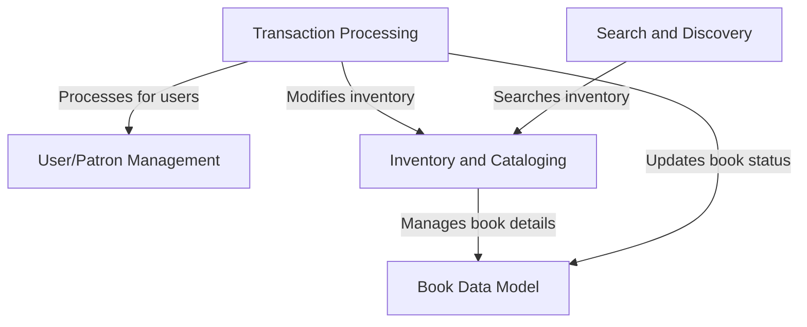
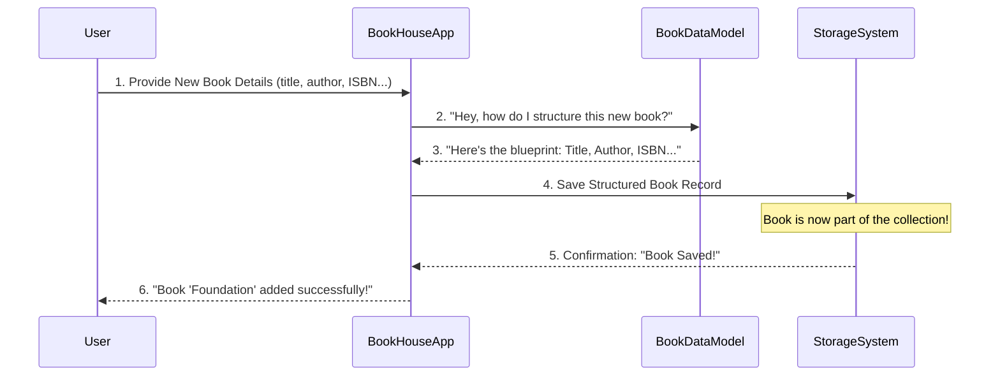
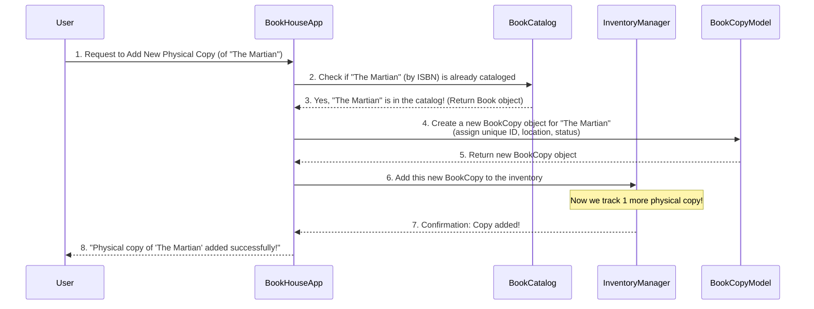
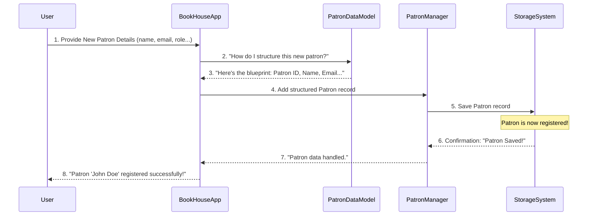
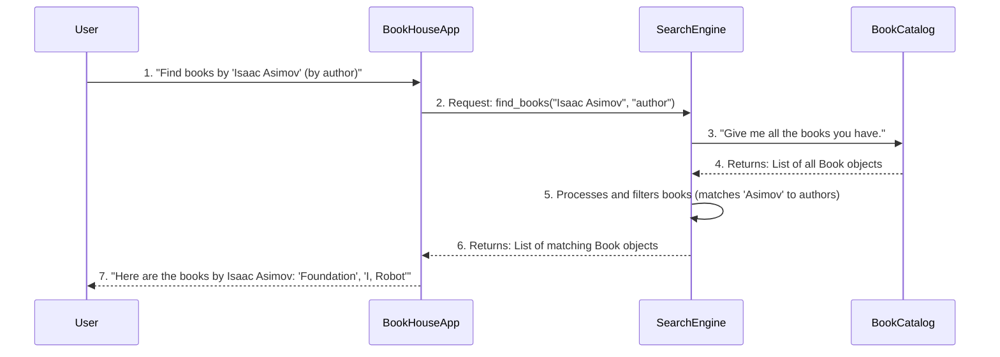
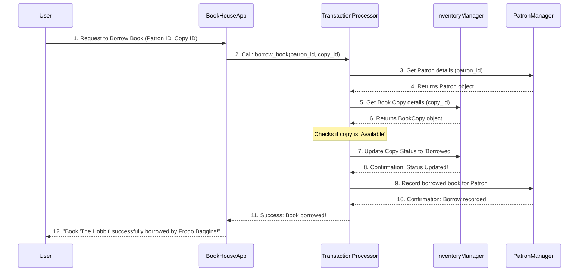

# Tutorial: susxBookHouse

The `susxBookHouse` project is essentially a **digital library or bookstore system**. It helps manage a collection of books by defining what a book is, tracking its *availability and location*, and handling all user interactions like *borrowing, returning, or purchasing*. Additionally, it provides powerful search capabilities to help users *discover* the books they are looking for.


## Visual Overview



## Chapters

1. [Book Data Model
   ](01_book_data_model_.md)
2. [Inventory and Cataloging
   ](02_inventory_and_cataloging_.md)
3. [User/Patron Management
   ](03_user_patron_management_.md)
4. [Search and Discovery
   ](04_search_and_discovery_.md)
5. [Transaction Processing
   ](05_transaction_processing_.md)

---

<sub><sup>Generated by [AI Codebase Knowledge Builder](https://github.com/The-Pocket/Tutorial-Codebase-Knowledge).</sup></sub>


# Chapter 1: Book Data Model

Welcome to the **susxBookHouse** project! Imagine you're building a new library system. The very first thing you need to figure out is: "What *is* a book in our system?" Is it just a pile of pages? A digital file? How do we keep track of all the important details about it?

This is where the **Book Data Model** comes in. Think of it as the master blueprint or a super detailed index card for every single book in your BookHouse. It's an agreement on what information we *must* know about a book and how that information should be organized. This ensures that whether you're adding a new bestseller or looking up an old classic, every book record follows the same consistent structure. Without this model, our library would be a chaotic mess of unorganized information!

Let's imagine our first big task: **adding a brand new book to the BookHouse**. How do we tell the system what this new book is all about? We use the Book Data Model!

## What Makes a Book? Key Attributes

The Book Data Model defines specific "attributes" or pieces of information that describe each book. These are like the fields on our detailed index card.

Here are the most important attributes for a book in our `susxBookHouse` system:

| Attribute Name       | Description                                                                                             | Example                                    |
| :------------------- | :------------------------------------------------------------------------------------------------------ | :----------------------------------------- |
| **Title**            | The official name of the book.                                                                          | "The Hitchhiker's Guide to the Galaxy"     |
| **Author**           | The person or people who wrote the book.                                                                | "Douglas Adams"                            |
| **ISBN**             | International Standard Book Number. A unique 13-digit code used worldwide to identify books.            | "978-0345391803"                           |
| **Publication Date** | The date the book was originally published.                                                             | "1979-10-12"                               |
| **Availability**     | Indicates if the book is currently available for borrowing, borrowed, or otherwise out of circulation.  | "Available", "Borrowed", "On Hold"         |

These attributes give us a standardized way to talk about and store information for every book.

## Adding a Book to the System

Let's go back to our use case: adding a new book. We'll use these attributes to describe it. In a real application, you might fill out a form, and behind the scenes, the system would gather this information.

Here’s a simple, conceptual example of how we might describe a new book using these attributes in a programming language like Python:

```python
# Imagine we're creating a new book record
new_book_data = {
    "title": "Foundation",
    "author": "Isaac Asimov",
    "isbn": "978-0553803715",
    "publication_date": "1951-06-01",
    "availability": "Available"
}

# In a real system, you'd then pass this data to a function
# that adds the book to the BookHouse.
# For now, let's just print what we've defined.
print("Prepared to add a new book:")
print(f"Title: {new_book_data['title']}")
print(f"Author: {new_book_data['author']}")
print(f"ISBN: {new_book_data['isbn']}")
```

When you "add" this `new_book_data` to the system, it doesn't just print it; it creates a structured record using our Book Data Model and stores it. The output from the system (what you'd see or what would happen) is that a new book entry, complete with all these details, is now officially part of the `susxBookHouse` collection!

## Under the Hood: How the Book Data Model Works

So, what exactly happens when we provide this `new_book_data`?

1.  **You Provide Information:** You, the user (or another part of the system), give the `susxBookHouse` application all the details for a new book (title, author, ISBN, etc.).
2.  **The Application Understands:** The `susxBookHouse` application receives this information. It knows, thanks to the Book Data Model, *what* each piece of information is and *where* it fits. It's like having a pre-printed form where each piece of data goes into the correct box.
3.  **Data is Structured:** The application uses the Book Data Model's blueprint to organize this raw data into a consistent book object or record.
4.  **Data is Stored:** This newly structured book record is then saved permanently into the BookHouse's storage system, ready to be retrieved later.

Here's a simplified sequence of events using a diagram:



### Looking at the Code (Conceptual)

While the full internal code for `susxBookHouse` is more complex, at its core, the Book Data Model is often represented by a "class" in programming. A class is like a template for creating objects (like individual books).

Imagine a file that defines what a Book should look like (let's call it `book_model.py`):

```python
# book_model.py (Conceptual file)

class Book:
    """
    This is our blueprint (data model) for what a Book is
    in the susxBookHouse system.
    """
    def __init__(self, title, author, isbn, publication_date, availability="Available"):
        self.title = title
        self.author = author
        self.isbn = isbn
        self.publication_date = publication_date
        self.availability = availability # Default to 'Available'

    # We might add more methods here later, like changing availability
    def __str__(self):
        return f"{self.title} by {self.author} (ISBN: {self.isbn})"

```
This `Book` class defines the attributes (`title`, `author`, `isbn`, etc.) that every `Book` object will have. The `__init__` method is like the constructor that takes the initial details when you "create" a new book.

Then, when we want to add a book, we'd use this blueprint:

```python
# main_application.py (Conceptual usage)

# We import our Book blueprint
# from book_model import Book

# Create an actual book object using our blueprint
book1 = Book(
    title="Dune",
    author="Frank Herbert",
    isbn="978-0441172719",
    publication_date="1965-08-01",
    availability="Available"
)

book2 = Book(
    title="1984",
    author="George Orwell",
    isbn="978-0451524935",
    publication_date="1949-06-08",
    availability="Borrowed"
)

print("First book created:", book1)
print("Second book created:", book2)

# Now, these 'book1' and 'book2' objects would be saved
# into our StorageSystem (as shown in the sequence diagram).
```
This simplified code shows how the Book Data Model, represented by the `Book` class, gives us a consistent way to define and work with book information. Each `book1` and `book2` is an "instance" of our `Book` blueprint, containing its own specific data but following the same structure.

## Conclusion

In this chapter, we learned that the **Book Data Model** is the fundamental definition of what a "book" is within the `susxBookHouse` system. It's like the detailed index card or blueprint, specifying key attributes such as title, author, ISBN, publication date, and availability. By having this consistent model, we ensure that all book-related information is structured and easily manageable.

Now that we understand how to define a single book, the next logical step is to figure out how to manage *all* the books in our library! How do we keep track of thousands of books, where they are, and whether they're available? That's what we'll explore in the next chapter.

[Next Chapter: Inventory and Cataloging](02_inventory_and_cataloging_.md)

---

<sub><sup>Generated by [AI Codebase Knowledge Builder](https://github.com/The-Pocket/Tutorial-Codebase-Knowledge).</sup></sub> <sub><sup>**References**: [[1]](https://github.com/codeChris1009/susxBookHouse/blob/d01d0792dd364a7e8dcaf551f2bdab65f9c52be8/README.md)</sup></sub>


# Chapter 2: Inventory and Cataloging

Welcome back to the **susxBookHouse** project! In [Chapter 1: Book Data Model](01_book_data_model_.md), we learned how to define what a single book *is* in our system – its title, author, ISBN, and so on. We now know how to create a "blueprint" for *one* book.

But what happens when you have a whole library full of books? Libraries don't just have one copy of "The Hitchhiker's Guide to the Galaxy"; they often have multiple copies, perhaps even in different locations or editions. How do we keep track of all these individual books, where they are, and whether they're available for someone to borrow?

This is where **Inventory and Cataloging** comes in!

Imagine our `susxBookHouse` is a real-world library.
*   **Cataloging** is like creating the old-fashioned "card catalog" (or the digital equivalent). It's where you list all the *different titles* your library owns and all the important information about them (author, publication year, genre). It helps people *discover* books.
*   **Inventory** is like walking through the library shelves, counting each physical book, noting its shelf location, and marking if it's currently on the shelf, borrowed, or maybe even lost. It tells you exactly *which physical books* you have and their status.

Together, Inventory and Cataloging make sure we know:
1.  **What books we have:** All the unique titles (Cataloging).
2.  **How many copies of each book:** The physical count (Inventory).
3.  **Where each physical copy is:** Its location (Inventory).
4.  **If a copy is available:** Its current status (Inventory).

Our goal for this chapter is to understand how we can **add a new physical copy of a book to our BookHouse**, making sure it's properly registered and tracked.

## Two Big Ideas: Catalog and Inventory

Let's break down how we achieve this in `susxBookHouse`.

### 1. The Book Catalog: Our Master List of Titles

First, we need a central place to store all the unique book titles we own. This is our "Book Catalog." When we define a book using the [Book Data Model](01_book_data_model_.md), that book needs to be added to this catalog. Think of it as officially registering the book's information.

For example, if we have the book "Dune" by Frank Herbert, we'd add its core details (title, author, ISBN) to our catalog. This is a one-time process for *each unique title*.

### 2. The Book Inventory: Tracking Each Physical Copy

Once a book is in our catalog, we can then start adding *physical copies* of that book to our inventory. Each physical copy is a separate item that needs to be tracked individually.

Consider "Dune" again. We might have three copies:
*   Copy 1: On shelf A, available.
*   Copy 2: Borrowed by a patron.
*   Copy 3: On shelf B, available.

Each of these is a `BookCopy`. It refers back to the main "Dune" entry in the catalog but has its own unique ID, location, and status.

## How We Add a New Physical Book Copy

Let's use our central goal: **adding a brand new physical book copy to the `susxBookHouse` collection.**

This involves a few steps:

1.  **Ensure the Book is Cataloged:** First, we check if the book's core information (like its ISBN) is already in our Book Catalog. If it's a completely new title for the library, we add it to the catalog using the [Book Data Model](01_book_data_model_.md) we learned in Chapter 1.
2.  **Create a Unique Copy Record:** We then create a specific record for *this* physical book. This record will have its own unique ID, its current location (e.g., "Main Shelf - SciFi Section"), and its initial status ("Available").
3.  **Add to Inventory:** Finally, this new copy record is added to our `susxBookHouse` inventory, making it officially trackable.

### Example: Adding a Copy of "The Martian"

Let's say we want to add a copy of "The Martian" by Andy Weir.

First, we might define our `Book` object (from Chapter 1):

```python
# Imagine this is our 'Book' blueprint from 01_book_data_model_.md
class Book:
    def __init__(self, title, author, isbn, publication_date):
        self.title = title
        self.author = author
        self.isbn = isbn
        self.publication_date = publication_date

    def __str__(self):
        return f'"{self.title}" by {self.author} (ISBN: {self.isbn})'

# Create the main book record for "The Martian"
the_martian_book = Book(
    title="The Martian",
    author="Andy Weir",
    isbn="978-0804139021",
    publication_date="2014-02-11"
)

print("Book defined:", the_martian_book)
```
**Explanation:** This code snippet first reminds us of our `Book` blueprint. Then, it creates a specific `Book` object for "The Martian" using that blueprint. This is the information we would add to our Catalog.

Next, we need a way to represent the *physical copy* of this book. We'll create a new blueprint for that: `BookCopy`.

```python
# book_copy_model.py (Conceptual file)
import uuid # For generating unique IDs

class BookCopy:
    def __init__(self, book_item, location="Main Shelf", status="Available"):
        self.copy_id = str(uuid.uuid4()) # A unique ID for THIS physical copy
        self.book_item = book_item       # This links back to our 'Book' object
        self.location = location         # Where is this copy located?
        self.status = status             # Is it available, borrowed, etc.?

    def __str__(self):
        return (f"Copy ID: {self.copy_id[:8]}... | "
                f"Book: {self.book_item.title} | Location: {self.location} | Status: {self.status}")

# Now, let's create a physical copy of "The Martian"
new_martian_copy = BookCopy(
    book_item=the_martian_book, # Link to the 'Book' object we created earlier
    location="SciFi - Aisle 3",
    status="Available"
)

print("\nNew physical copy created:")
print(new_martian_copy)
```
**Explanation:** Here, we define `BookCopy`, which is a blueprint for each physical book. It has a unique `copy_id`, refers to the `book_item` (our "The Martian" `Book` object), and tracks its `location` and `status`. We then create an actual `new_martian_copy` using this blueprint, linking it to `the_martian_book`. The output shows a unique ID for this specific copy.

## Under the Hood: Managing Catalog and Inventory

So, how does the `susxBookHouse` system actually manage these `Book` and `BookCopy` objects? It needs managers!

We'll have:
*   A `BookCatalog` to hold all the unique `Book` definitions.
*   An `InventoryManager` to hold all the `BookCopy` objects.

When we ask to "add a physical copy," the system does a little dance:


**Explanation:** This diagram shows the steps. The `User` tells the `BookHouseApp` to add a copy. The app first consults the `BookCatalog` to make sure it knows the *book itself*. Then, it creates a specific `BookCopy` and adds it to the `InventoryManager`.

### Looking at the Code (Conceptual Managers)

Let's imagine how our `susxBookHouse` might bring this all together.

```python
# bookhouse_managers.py (Conceptual file combining our management)

# We need our Book blueprint from Chapter 1
# And our new BookCopy blueprint
# from book_model import Book
# from book_copy_model import BookCopy # (assuming these are in separate files)

class BookCatalog:
    """Manages all unique Book titles in our system."""
    def __init__(self):
        self.books = {} # Stores books, maybe keyed by ISBN

    def add_book(self, book: Book):
        if book.isbn not in self.books:
            self.books[book.isbn] = book
            print(f"Cataloged: {book.title}")
            return True
        print(f"'{book.title}' already in catalog.")
        return False

    def get_book(self, isbn: str):
        return self.books.get(isbn)


class InventoryManager:
    """Manages all physical BookCopy items."""
    def __init__(self):
        self.copies = {} # Stores book copies, keyed by their unique copy_id

    def add_copy(self, book_copy: BookCopy):
        self.copies[book_copy.copy_id] = book_copy
        print(f"Added to inventory: {book_copy}")

    def get_copy(self, copy_id: str):
        return self.copies.get(copy_id)

# --- How we'd use these managers in our main application ---
# Create our managers
book_catalog = BookCatalog()
inventory_manager = InventoryManager()

# 1. First, make sure the book is in the catalog
the_martian_book = Book( # Re-creating for demonstration; normally you'd get it.
    title="The Martian",
    author="Andy Weir",
    isbn="978-0804139021",
    publication_date="2014-02-11"
)
book_catalog.add_book(the_martian_book) # Add to catalog

# 2. Now, create and add a copy to the inventory
new_copy_1 = BookCopy(the_martian_book, location="SciFi - Aisle 3")
inventory_manager.add_copy(new_copy_1)

# Add another copy!
new_copy_2 = BookCopy(the_martian_book, location="SciFi - New Arrivals")
inventory_manager.add_copy(new_copy_2)

print(f"\nTotal books in catalog: {len(book_catalog.books)}")
print(f"Total copies in inventory: {len(inventory_manager.copies)}")
```
**Explanation:**
*   We define `BookCatalog` to keep track of all unique `Book` objects (our "titles").
*   We define `InventoryManager` to keep track of all individual `BookCopy` objects (our "physical items").
*   Then, we simulate adding "The Martian" to the catalog, and two separate physical copies of it to the inventory.
*   Notice how `new_copy_1` and `new_copy_2` are distinct `BookCopy` objects, each with their own `copy_id` and location, but both refer back to the *same* `the_martian_book` object from the catalog. This is the core of Inventory and Cataloging!

## Conclusion

In this chapter, we've explored **Inventory and Cataloging**, the crucial system for managing all the books in `susxBookHouse`. We learned that:

*   **Cataloging** is about registering unique book titles and their core information using the [Book Data Model](01_book_data_model_.md).
*   **Inventory** is about tracking each physical `BookCopy` – its unique ID, location, and availability status.
*   By combining these, we can efficiently add, store, and keep track of every single book item in our library.

Now that we know how to define books and manage their physical copies, the next logical step is to think about the people who will actually *use* our library system – the patrons! How do we keep track of them and their interactions with the books? That's what we'll dive into in the next chapter.

[Next Chapter: User/Patron Management](03_user_patron_management_.md)

---

<sub><sup>Generated by [AI Codebase Knowledge Builder](https://github.com/The-Pocket/Tutorial-Codebase-Knowledge).</sup></sub> <sub><sup>**References**: [[1]](https://github.com/codeChris1009/susxBookHouse/blob/d01d0792dd364a7e8dcaf551f2bdab65f9c52be8/README.md)</sup></sub>


# Chapter 3: User/Patron Management

Welcome back to the **susxBookHouse** project! In [Chapter 1: Book Data Model](01_book_data_model_.md), we learned how to define what a single book *is*. Then, in [Chapter 2: Inventory and Cataloging](02_inventory_and_cataloging_.md), we figured out how to keep track of all the physical copies of those books in our library. We now have a great system for managing our books!

But what about the people who actually use the `susxBookHouse`? Who borrows the books, who buys them, and who helps manage the library? We need a way to keep track of all these important individuals!

This is where **User/Patron Management** comes in.

Imagine the `susxBookHouse` as a real library or bookstore. You wouldn't just let anyone walk in and borrow books without knowing who they are, right? You'd need a membership desk or a registration system. User/Patron Management is exactly that: it's like the digital membership desk for our BookHouse.

Its main job is to handle all the information and operations related to the individuals who interact with the `susxBookHouse`. This includes:
*   **Readers/Borrowers:** People who borrow books.
*   **Customers:** People who might buy books (if our BookHouse expands into sales).
*   **Librarians:** The staff who manage the library.

Our main goal for this chapter is to understand how we can **add a brand new user or patron to our `susxBookHouse` system**, making sure their details are properly recorded.

## What is a User or Patron?

In the `susxBookHouse` context, a "User" or "Patron" is simply anyone who needs to be registered with the system to perform actions. They could be a student borrowing a textbook, a local resident checking out a novel, or a librarian helping another patron. Each one is a distinct individual we need to identify and manage.

## What Information Do We Need About a Patron? Key Attributes

Just like a book has important attributes (title, author), a patron also needs specific details recorded. These are like the fields on a membership registration form.

Here are the most important attributes for a patron in our `susxBookHouse` system:

| Attribute Name        | Description                                                                     | Example                                     |
| :-------------------- | :------------------------------------------------------------------------------ | :------------------------------------------ |
| **Patron ID**         | A unique identifier for each patron.                                            | "P-00123", "P-98765"                        |
| **Name**              | The full name of the patron.                                                    | "Alice Smith"                               |
| **Contact Email**     | The patron's email address for notifications.                                   | "alice.smith@example.com"                   |
| **Membership Status** | Indicates if the patron's membership is active or inactive.                     | "Active", "Inactive"                        |
| **Role**              | Describes their role: e.g., 'Reader', 'Librarian'.                              | "Reader"                                    |

These attributes give us a standardized way to describe and store information for every patron.

## The Patron Data Model: Our Blueprint for People

Similar to how we had a [Book Data Model](01_book_data_model_.md) to define a book, we need a **Patron Data Model** to define what a "patron" or "user" is in our system. It's the blueprint that ensures every patron record follows the same consistent structure.

## Adding a New Patron to the System

Let's use our central use case: **adding a brand new patron to the BookHouse**. We'll use the Patron Data Model to describe this new person. In a real application, a librarian might fill out a form, and behind the scenes, the system would gather this information.

Here’s a simple, conceptual example of how we might describe a new patron using these attributes in a programming language like Python:

```python
# Imagine we're creating a new patron record
new_patron_data = {
    "patron_id": "P-001",
    "name": "John Doe",
    "contact_email": "john.doe@example.com",
    "membership_status": "Active",
    "role": "Reader"
}

# In a real system, you'd then pass this data to a function
# that adds the patron to the BookHouse.
# For now, let's just print what we've defined.
print("Prepared to register a new patron:")
print(f"Patron ID: {new_patron_data['patron_id']}")
print(f"Name: {new_patron_data['name']}")
```
**Explanation:** This snippet defines a dictionary `new_patron_data` that holds all the necessary information for our new patron, John Doe. This is the information that will be used to create a new patron record.

When you "add" this `new_patron_data` to the system, it doesn't just print it; it creates a structured record using our Patron Data Model and stores it. The output from the system is that a new patron entry, complete with all these details, is now officially part of the `susxBookHouse` community!

## Under the Hood: How Patron Data is Managed

So, what exactly happens when we provide this `new_patron_data`?

1.  **You Provide Information:** You, the user (or another part of the system), give the `susxBookHouse` application all the details for a new patron (name, email, etc.).
2.  **The Application Understands:** The `susxBookHouse` application receives this information. It knows, thanks to the Patron Data Model, *what* each piece of information is and *where* it fits.
3.  **Data is Structured:** The application uses the Patron Data Model's blueprint to organize this raw data into a consistent patron object or record.
4.  **Data is Stored:** This newly structured patron record is then saved permanently into the BookHouse's storage system, ready to be retrieved later (e.g., when John Doe wants to borrow a book).

Here's a simplified sequence of events using a diagram:



### Looking at the Code (Conceptual)

While the full internal code for `susxBookHouse` is more complex, at its core, the Patron Data Model is often represented by a "class" in programming, just like our `Book` class in Chapter 1.

Imagine a file that defines what a Patron should look like (let's call it `patron_model.py`):

```python
# patron_model.py (Conceptual file)
import uuid # To generate unique Patron IDs

class Patron:
    """
    This is our blueprint (data model) for what a Patron is
    in the susxBookHouse system.
    """
    def __init__(self, name, contact_email, role="Reader", membership_status="Active"):
        self.patron_id = "P-" + str(uuid.uuid4())[:5] # Generate a unique ID
        self.name = name
        self.contact_email = contact_email
        self.role = role
        self.membership_status = membership_status

    def __str__(self):
        return f"Patron ID: {self.patron_id} | Name: {self.name} ({self.role})"

```
**Explanation:** This `Patron` class defines the attributes that every `Patron` object will have. The `__init__` method is like the constructor that takes the initial details when you "create" a new patron, and automatically assigns a unique `patron_id`.

Then, we need a way to manage a collection of these patrons, similar to our `BookCatalog` or `InventoryManager` from Chapter 2. Let's imagine a `PatronManager`:

```python
# patron_manager.py (Conceptual file)
# from patron_model import Patron # (assuming Patron class is in another file)

class PatronManager:
    """Manages all Patron objects in our system."""
    def __init__(self):
        self.patrons = {} # Stores patrons, keyed by their unique patron_id

    def add_patron(self, patron: Patron):
        if patron.patron_id not in self.patrons:
            self.patrons[patron.patron_id] = patron
            print(f"Registered new patron: {patron}")
            return True
        print(f"Patron with ID {patron.patron_id} already exists.")
        return False

    def get_patron(self, patron_id: str):
        return self.patrons.get(patron_id)

# --- How we'd use these in our main application ---
# Create our Patron Manager
patron_manager = PatronManager()

# Create actual patron objects using our blueprint
patron1 = Patron(name="Alice Wonderland", contact_email="alice@example.com")
patron2 = Patron(name="Bob The Builder", contact_email="bob@example.com", role="Librarian")

# Add them to the manager
patron_manager.add_patron(patron1)
patron_manager.add_patron(patron2)

print(f"\nTotal patrons registered: {len(patron_manager.patrons)}")
```
**Explanation:**
*   We define `PatronManager` to keep track of all our `Patron` objects.
*   We create `patron1` and `patron2` using our `Patron` blueprint. Each automatically gets a unique `patron_id`.
*   Then, we use `patron_manager.add_patron()` to register them in our system.
*   The output shows that two unique patrons have been created and added to our manager's collection.

This simplified code shows how the Patron Data Model, represented by the `Patron` class, and the `PatronManager` work together to give us a consistent way to define and manage user information in `susxBookHouse`.

## Conclusion

In this chapter, we've introduced **User/Patron Management**, which is essential for handling all the individuals who interact with the `susxBookHouse`. We learned:

*   Why it's important to track patrons (readers, librarians, customers).
*   The key attributes (ID, name, email, role, status) that define a patron.
*   How the `Patron` Data Model acts as a blueprint for consistent patron records.
*   How to conceptually add new patrons to the system, making them officially registered.

Now that we know how to manage books and the people who use them, the next exciting step is to figure out how these people can actually *find* the books they're looking for! How do we make sure our vast collection is easily accessible? That's what we'll explore in the next chapter.

[Next Chapter: Search and Discovery](04_search_and_discovery_.md)

---

<sub><sup>Generated by [AI Codebase Knowledge Builder](https://github.com/The-Pocket/Tutorial-Codebase-Knowledge).</sup></sub> <sub><sup>**References**: [[1]](https://github.com/codeChris1009/susxBookHouse/blob/d01d0792dd364a7e8dcaf551f2bdab65f9c52be8/README.md)</sup></sub>

# Chapter 4: Search and Discovery

Welcome back to the **susxBookHouse** project! In [Chapter 1: Book Data Model](01_book_data_model_.md), we learned how to define what a single book *is*. Then, in [Chapter 2: Inventory and Cataloging](02_inventory_and_cataloging_.md), we figured out how to keep track of all the physical copies of those books. And in [Chapter 3: User/Patron Management](03_user_patron_management_.md), we learned how to manage the people who use our library.

Now, imagine our `susxBookHouse` has grown! We have thousands of books and many happy patrons. But there's a new challenge: how do people *find* the book they're looking for among so many? If someone asks, "Do you have any science fiction by Isaac Asimov?" or "Where is that book about space travel?", how does our system help them?

This is where **Search and Discovery** comes in!

Think of Search and Discovery as the `susxBookHouse`'s super-smart librarian or an advanced search engine, specifically designed to help users navigate our vast collection. Its main job is to provide the tools for users to:
*   Find a **specific book** they know the title or author of.
*   **Browse the collection** based on general ideas like a genre or keywords.

Our goal for this chapter is to understand how we can **enable a user to search for books in the `susxBookHouse` collection**, helping them find exactly what they need.

## What Are We Searching For?

When a user searches, they're looking for `Book` objects that we defined in our [Book Data Model](01_book_data_model_.md) and added to our [Book Catalog](02_inventory_and_cataloging_.md). The search system doesn't directly look at physical copies (from `BookCopy`), but rather at the detailed information about each unique book title (like its title, author, ISBN).

## How Does Search and Discovery Work? Key Ideas

To make searching possible, we need a way to look through all the book information we've stored and find matches.

Here are the key ideas:

1.  **Search Criteria:** What information can users use to search?
    *   **Title:** The book's name (e.g., "Dune").
    *   **Author:** Who wrote it (e.g., "Frank Herbert").
    *   **ISBN:** The unique book identification number (e.g., "978-0441172719").
    *   **Keywords:** Any important words in the title or description (e.g., "space", "future").
2.  **Matching:** The system compares the user's search term with the book's information (attributes). If there's a match, that book is a search result.
3.  **Returning Results:** The system gives back a list of all the books that match the search criteria.

## Solving Our Use Case: Searching for Books

Let's imagine a user wants to find all books written by "Isaac Asimov".

To do this, our `susxBookHouse` needs a function that can take a search term (like "Asimov") and a criteria (like "author") and return matching books.

First, let's remind ourselves of our `Book` blueprint and how we catalog books (from previous chapters).

```python
# book_model.py (Review from Chapter 1)
class Book:
    def __init__(self, title, author, isbn, publication_date):
        self.title = title
        self.author = author
        self.isbn = isbn
        self.publication_date = publication_date

    def __str__(self):
        return f'"{self.title}" by {self.author}'

# bookhouse_managers.py (Review from Chapter 2 - simplified BookCatalog)
class BookCatalog:
    def __init__(self):
        self.books = {} # Stores books, keyed by ISBN

    def add_book(self, book: Book):
        if book.isbn not in self.books:
            self.books[book.isbn] = book
        return self.books[book.isbn] # Return the added/existing book

    def get_all_books(self):
        return list(self.books.values()) # Get all book objects

# Let's populate a small catalog for our search example
book_catalog = BookCatalog()
book_catalog.add_book(Book("Foundation", "Isaac Asimov", "978-0553803715", "1951-06-01"))
book_catalog.add_book(Book("Dune", "Frank Herbert", "978-0441172719", "1965-08-01"))
book_catalog.add_book(Book("I, Robot", "Isaac Asimov", "978-0553803722", "1950-12-02"))
book_catalog.add_book(Book("The Martian", "Andy Weir", "978-0804139021", "2014-02-11"))

print("Current books in catalog:")
for book in book_catalog.get_all_books():
    print(f"- {book}")
```
**Explanation:** This code sets up our basic `Book` class and `BookCatalog` from previous chapters. We've added a few example books to our `book_catalog` so we have something to search through.

Now, let's add the core **Search and Discovery** logic. We'll create a `SearchEngine` that can look through the `BookCatalog`.

```python
# search_engine.py (Conceptual file)

# from book_model import Book
# from bookhouse_managers import BookCatalog # We need our catalog

class SearchEngine:
    """Provides functionality to search for books in the catalog."""
    def __init__(self, catalog: BookCatalog):
        self.catalog = catalog

    def find_books(self, query: str, search_by: str = "title"):
        """
        Searches the catalog for books based on a query and criteria.
        'search_by' can be 'title', 'author', or 'isbn'.
        """
        results = []
        query_lower = query.lower() # Convert query to lowercase for case-insensitive search

        for book in self.catalog.get_all_books():
            if search_by == "title" and query_lower in book.title.lower():
                results.append(book)
            elif search_by == "author" and query_lower in book.author.lower():
                results.append(book)
            elif search_by == "isbn" and query_lower == book.isbn.lower():
                results.append(book)
        return results

# --- How we'd use the SearchEngine in our main application ---
print("\n--- Performing Searches ---")

# Create our search engine, giving it access to our book_catalog
search_engine = SearchEngine(book_catalog)

# Search 1: Find all books by 'Isaac Asimov'
print("\nSearching for author 'Isaac Asimov':")
asimov_books = search_engine.find_books("Isaac Asimov", search_by="author")
if asimov_books:
    for book in asimov_books:
        print(f"- Found: {book}")
else:
    print("No books found by Isaac Asimov.")

# Search 2: Find books with 'Dune' in the title
print("\nSearching for title 'Dune':")
dune_books = search_engine.find_books("Dune", search_by="title")
if dune_books:
    for book in dune_books:
        print(f"- Found: {book}")
else:
    print("No books found with 'Dune' in the title.")
```
**Explanation:**
*   We define a `SearchEngine` class that takes our `BookCatalog` when it's created. This gives it access to all the books.
*   The `find_books` method is the core of our search. It takes a `query` (what you're looking for) and `search_by` (how you want to look, e.g., by "title" or "author").
*   It then loops through *every* book in the catalog.
*   For each book, it checks if the `query` matches the specified `search_by` attribute (like `book.author` or `book.title`). We convert both the query and the book's attribute to lowercase to make the search case-insensitive (so "asimov" matches "Asimov").
*   Finally, it collects all matching books and returns them.
*   The example usage demonstrates how to create a `SearchEngine` and then use it to find books by author and by title, showing the found book details.

## Under the Hood: The Search Process

When you ask the `susxBookHouse` to search for a book, here's a simplified sequence of what happens:


**Explanation:**
1.  The `User` tells the `BookHouseApp` what they want to search for.
2.  The `BookHouseApp` passes this request to the `SearchEngine`.
3.  The `SearchEngine` asks the `BookCatalog` for all available book data.
4.  The `BookCatalog` provides the `SearchEngine` with all the [Book Data Model](01_book_data_model_.md) information it holds.
5.  The `SearchEngine` then does the actual work of comparing the search query to each book's attributes (like title, author, ISBN) to find matches.
6.  It sends the list of found books back to the `BookHouseApp`.
7.  Finally, the `BookHouseApp` shows these results to the `User`.

### Looking at the Code (Combining Managers)

The `SearchEngine` acts as a helper that uses information from other parts of our system, particularly the `BookCatalog`. This shows how different parts of `susxBookHouse` work together.

```python
# main_application.py (Conceptual usage combining managers)

# Imagine Book, BookCatalog, SearchEngine are imported from their files

# Initialize our core components
main_book_catalog = BookCatalog() # From Chapter 2
main_search_engine = SearchEngine(main_book_catalog) # Our new search engine

# Add some books to the catalog (from earlier example)
main_book_catalog.add_book(Book("Foundation", "Isaac Asimov", "978-0553803715", "1951-06-01"))
main_book_catalog.add_book(Book("Dune", "Frank Herbert", "978-0441172719", "1965-08-01"))
main_book_catalog.add_book(Book("I, Robot", "Isaac Asimov", "978-0553803722", "1950-12-02"))

# Now, a user wants to search!
user_query = "Robot"
search_criteria = "title"

print(f"\nUser is searching for '{user_query}' by {search_criteria}...")
found_books = main_search_engine.find_books(user_query, search_by=search_criteria)

if found_books:
    print("Search Results:")
    for book in found_books:
        print(f"- {book}")
else:
    print("No books found matching your query.")
```
**Explanation:** This code brings together our `BookCatalog` and our new `SearchEngine`. It shows how in a real application, you'd create instances of these components, add data, and then use the `SearchEngine` to perform searches against the data stored in the `BookCatalog`. The output demonstrates finding "I, Robot" when searching for "Robot" in the title.

## Conclusion

In this chapter, we've explored **Search and Discovery**, an essential feature for any library system. We learned:

*   Why it's crucial for users to find books efficiently in a large collection.
*   That we search using criteria like title, author, or ISBN.
*   How the `SearchEngine` interacts with the `BookCatalog` to find matching [Book Data Model](01_book_data_model_.md) records.
*   How to conceptually implement a basic search function to return relevant books.

Now that we know how to manage books, patrons, and enable them to find books, the next logical step is to figure out how books can actually be borrowed or returned! How do we track the journey of a book as it moves between the library and a patron? That's what we'll dive into in the next chapter.

[Next Chapter: Transaction Processing](05_transaction_processing_.md)

---

<sub><sup>Generated by [AI Codebase Knowledge Builder](https://github.com/The-Pocket/Tutorial-Codebase-Knowledge).</sup></sub> <sub><sup>**References**: [[1]](https://github.com/codeChris1009/susxBookHouse/blob/d01d0792dd364a7e8dcaf551f2bdab65f9c52be8/README.md)</sup></sub>


# Chapter 5: Transaction Processing

Welcome back to the **susxBookHouse** project! In [Chapter 1: Book Data Model](01_book_data_model_.md), we defined what a book is. In [Chapter 2: Inventory and Cataloging](02_inventory_and_cataloging_.md), we learned to track individual physical copies. Then, in [Chapter 3: User/Patron Management](03_user_patron_management_.md), we learned how to manage all the people who use our library. And in [Chapter 4: Search and Discovery](04_search_and_discovery_.md), we enabled users to find the books they want.

Now, we have books, we have patrons, and we can find books. What's next? The whole point of a library or bookstore is for people to *interact* with books! They want to borrow them, return them, maybe even reserve or purchase them. How do we make sure these important actions are handled correctly and reliably?

This is where **Transaction Processing** comes in!

Think of Transaction Processing as the `susxBookHouse`'s busiest desk – it's the digital **checkout counter or lending desk**. Its core job is to manage all the key interactions between users and books. When a book is borrowed, its availability must be updated. When a book is returned, its status changes back. All these operations need to be recorded accurately so our system knows exactly what's happening with every book and every patron.

Our goal for this chapter is to understand how we can **process a core transaction: borrowing a book**.

## What is a "Transaction"?

In the world of `susxBookHouse`, a "transaction" isn't just about money. It's any operation that changes the state of our books or patron records. It's a single, complete unit of work.

Here are the main types of transactions we're talking about:

| Transaction Type | Description                                                      | What needs to change?                          |
| :--------------- | :--------------------------------------------------------------- | :--------------------------------------------- |
| **Borrowing**    | A patron takes a book copy from the library.                     | Book copy status, patron's borrowed books list |
| **Returning**    | A patron brings a borrowed book copy back.                       | Book copy status, patron's borrowed books list |
| **Reserving**    | A patron puts a hold on an unavailable book copy.                | Book copy status, patron's reserved books list |
| **Purchasing**   | A patron buys a book copy (if our BookHouse sells books).        | Book copy status, patron's purchase history    |

For each of these, we need to make sure that *all* the necessary changes happen correctly, or *none* of them happen at all. This "all or nothing" principle is key to keeping our system reliable.

## Solving Our Use Case: Borrowing a Book

Let's focus on our central use case: **a patron wants to borrow a specific physical copy of a book.**

To do this, our `susxBookHouse` needs to:
1.  Identify the **patron** (from [Chapter 3: User/Patron Management](03_user_patron_management_.md)).
2.  Identify the **specific book copy** being borrowed (from [Chapter 2: Inventory and Cataloging](02_inventory_and_cataloging_.md)).
3.  Check if the book copy is actually **available**.
4.  If available, update the book copy's **status** to "Borrowed".
5.  Record this transaction in the **patron's history**.

First, let's set up some conceptual data that we'll use for our example. We'll need a `BookCopy` and a `Patron`.

```python
# Imagine these classes are imported from previous chapters:
# from book_model import Book
# from book_copy_model import BookCopy
# from patron_model import Patron

# Create a sample book and a copy (from Chapter 1 & 2)
sample_book = Book("The Hobbit", "J.R.R. Tolkien", "978-0345339683", "1937-09-21")
sample_copy = BookCopy(sample_book, location="Fantasy Shelf A", status="Available")

# Create a sample patron (from Chapter 3)
sample_patron = Patron("Frodo Baggins", "frodo@shire.com")

print(f"Initial Book Copy Status: {sample_copy.status}")
print(f"Patron: {sample_patron.name}")
```
**Explanation:** Here we create a `Book` object for "The Hobbit", then a `BookCopy` for a specific physical copy of it, initially "Available". We also create a `Patron` object for "Frodo Baggins". These are the actors in our borrowing transaction.

Now, let's think about how we'd actually perform the "borrow" operation. We'll need a way to manage our `BookCopy` objects (our `InventoryManager` from Chapter 2) and our `Patron` objects (our `PatronManager` from Chapter 3).

```python
# Imagine these managers are imported and populated from previous chapters
# from bookhouse_managers import InventoryManager
# from patron_manager import PatronManager

class InventoryManager: # Simplified for this chapter
    def __init__(self):
        self.copies = {}
    def add_copy(self, book_copy):
        self.copies[book_copy.copy_id] = book_copy
    def get_copy(self, copy_id):
        return self.copies.get(copy_id)
    def update_copy_status(self, copy_id, new_status):
        if copy_id in self.copies:
            self.copies[copy_id].status = new_status
            return True
        return False

class PatronManager: # Simplified for this chapter
    def __init__(self):
        self.patrons = {}
    def add_patron(self, patron):
        self.patrons[patron.patron_id] = patron
    def get_patron(self, patron_id):
        return self.patrons.get(patron_id)
    def record_borrowed_book(self, patron_id, copy_id):
        # In a real system, Patron would have a list of borrowed books
        # For simplicity, we just "record" it here.
        print(f"DEBUG: Patron {patron_id} now has {copy_id} recorded as borrowed.")
        return True # Assume successful
```
**Explanation:** We've included simplified versions of `InventoryManager` and `PatronManager`. The `InventoryManager` now has a crucial `update_copy_status` method. The `PatronManager` has a placeholder `record_borrowed_book` method to show that patron records also need updating.

Now, let's combine these into our `TransactionProcessor`.

```python
# transaction_processor.py (Conceptual file)

class TransactionProcessor:
    """Manages borrowing, returning, and other book-related transactions."""
    def __init__(self, inventory_manager: InventoryManager, patron_manager: PatronManager):
        self.inventory_manager = inventory_manager
        self.patron_manager = patron_manager

    def borrow_book(self, patron_id: str, copy_id: str):
        patron = self.patron_manager.get_patron(patron_id)
        if not patron:
            print(f"Error: Patron ID {patron_id} not found.")
            return False

        book_copy = self.inventory_manager.get_copy(copy_id)
        if not book_copy:
            print(f"Error: Book Copy ID {copy_id} not found.")
            return False

        if book_copy.status != "Available":
            print(f"Error: Book copy '{book_copy.book_item.title}' (ID: {copy_id[:8]}...) is not available ({book_copy.status}).")
            return False

        # --- Perform the transaction ---
        self.inventory_manager.update_copy_status(copy_id, "Borrowed")
        self.patron_manager.record_borrowed_book(patron_id, copy_id)
        print(f"SUCCESS: '{book_copy.book_item.title}' borrowed by {patron.name}.")
        return True

# --- How we'd use this in our main application ---
# Create our managers and populate them
inventory_mgr = InventoryManager()
patron_mgr = PatronManager()

# Add our sample book copy and patron to the managers
inventory_mgr.add_copy(sample_copy)
patron_mgr.add_patron(sample_patron)

# Create our Transaction Processor
transaction_processor = TransactionProcessor(inventory_mgr, patron_mgr)

print("\n--- Attempting to borrow a book ---")
# Try to borrow the book
success = transaction_processor.borrow_book(sample_patron.patron_id, sample_copy.copy_id)

if success:
    # Check the updated status
    updated_copy = inventory_mgr.get_copy(sample_copy.copy_id)
    print(f"Updated Book Copy Status: {updated_copy.status}")
```
**Explanation:**
*   We define the `TransactionProcessor` class, which takes both an `InventoryManager` and a `PatronManager` when initialized. This allows it to coordinate changes across both systems.
*   The `borrow_book` method is our core transaction. It first checks if the patron and book copy exist and if the book is available.
*   If all checks pass, it then updates the `BookCopy` status to "Borrowed" using `inventory_manager.update_copy_status()` and records the borrow for the `Patron` using `patron_manager.record_borrowed_book()`.
*   The output shows the initial status, the success message after borrowing, and the updated status of the book copy.

## Under the Hood: The Borrowing Process

When a user asks to borrow a book, here's a simplified sequence of what happens:


**Explanation:**
1.  The `User` initiates the borrow request through the `BookHouseApp`.
2.  The `BookHouseApp` delegates this to the `TransactionProcessor`.
3.  The `TransactionProcessor` retrieves details about the `Patron` from the `PatronManager`.
4.  It then retrieves details about the `BookCopy` from the `InventoryManager`.
5.  Crucially, the `TransactionProcessor` verifies that the book copy is actually "Available". If not, the transaction fails.
6.  If available, it tells the `InventoryManager` to change the book copy's status.
7.  It also tells the `PatronManager` to update the patron's record (e.g., adding this book to their list of currently borrowed items).
8.  Only if *both* updates succeed, the `TransactionProcessor` confirms the successful transaction back to the `BookHouseApp` and then to the `User`. This ensures reliability.

## Conclusion

In this chapter, we've explored **Transaction Processing**, the vital system that manages all key interactions between users and books in `susxBookHouse`. We learned:

*   Why it's essential to reliably handle operations like borrowing, returning, and reserving books.
*   That a "transaction" in this context refers to a complete, atomic unit of work that changes system state.
*   How the `TransactionProcessor` acts as the central coordinator, interacting with the `InventoryManager` (for book copies) and `PatronManager` (for user records) to ensure these operations are correct and consistent.
*   How to conceptually implement a basic `borrow_book` function, highlighting the checks and updates involved.

This chapter completes our core journey through the fundamental abstractions of the `susxBookHouse` project. We now have a robust understanding of how books are modeled, inventoried, and cataloged; how users are managed; how books are found; and how critical interactions are processed reliably.

---

<sub><sup>Generated by [AI Codebase Knowledge Builder](https://github.com/The-Pocket/Tutorial-Codebase-Knowledge).</sup></sub> <sub><sup>**References**: [[1]](https://github.com/codeChris1009/susxBookHouse/blob/d01d0792dd364a7e8dcaf551f2bdab65f9c52be8/README.md)</sup></sub>